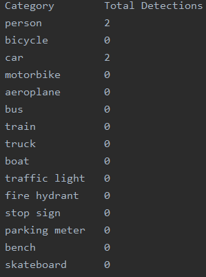
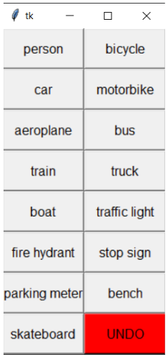

# AnntotationTool
AnnotationTool is a mini-project created to easy annotating videos for Computer Vision Training and Evaluation

Our AnnotationTool is based on Python language and is very simple but useful. Basically it involves 2 scripts, each of one has different aims while annoting.

 # Category Identification
"Category Identification" is simplier. The main objective of this script is to annotate the number of each type of object detected in a whole video. Therefore, we set some classes in a txt file and , through a button pressing menu, we can count all objects that appear in real time on the video. 

 ### Annotation.txt
 In order to so, it is necessary to have an annotation file for each video which indicates all specific objects that appeared with some information for each of them:
 
  - Category of Object found
  - Number of times the object has been detected in the video
  
  
  
  The outputs are automatically saved on the directory category_annotations. If this directory does not exist, an error will raise.
  The name of the annotation output will be the name of the input video with .txt extension.

  
  ### How to execute it
  In order to execute the script it is necessary to use the following command:
  > python cat_annotation.py -v <INPUT_VIDEO_PATH> [--delay DELAY] [--scale SCALE]
  
  - INPUT_VIDEO_PATH : required argument which has the path of the video we want to annotate.
  - DELAY : optional argument (default = 0). Video can be runned in slow motion, DELAY is the time (in seconds) of sleep between frames. If argument is set bigger, the Delay increase. Default is video at real time
  - SCALE: optional argument (default = 3). In order to visualize the video on real time, there is the possibility of resize the visualitzation frames in order to make it the display screen smaller. It is a relation number
  
  ### How it really works?
  
The main interest of this script is to enumerate the number of objects of different categories that appear in a subclip.
To do so, what we have done is an script that plays the video and let, by pressing a button, count a +1 in the category the button was pressed.
There is also the undo button to undo the detection already made if needed.

  

You can also pause (“s”) and resume (“r”) the video if needed.
You can also press “q” for quitting.

All the categories which are displayed on the menu button are read from the ["Classes.txt"](https://github.com/Evm7/AnntotationTool/CategoryIdentification/Classes.txt) file.
If you want to change the subclases, just update the txt file with all classes you are interested in.
