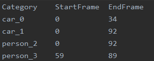
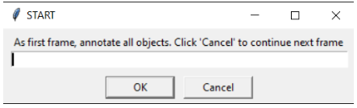
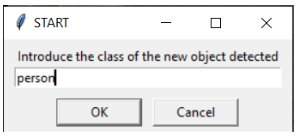
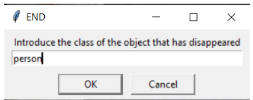
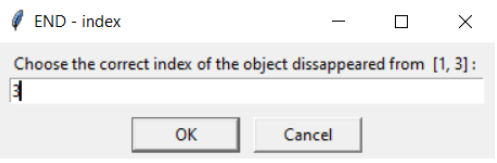
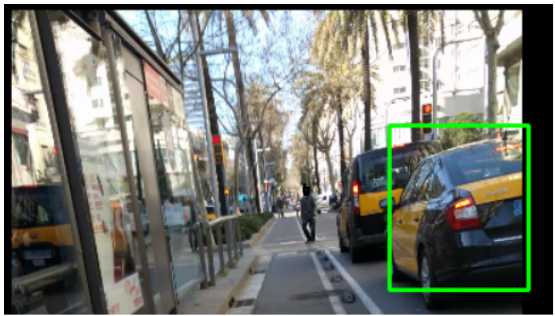
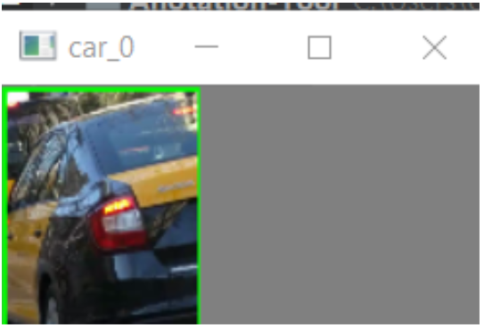

# AnntotationTool
AnnotationTool is a mini-project created to easy annotating videos for Computer Vision Training and Evaluation

Our AnnotationTool is based on Python language and is very simple but useful. Basically it involves 2 scripts, each of one has different aims while annoting.

 # Frame Identification
 "Frame Identification" relies on the important aspect that some times, when we are detecting and tracking objects in videos, we want to make sure that the object is detected approximately on first appearence, and mark as disappeared as soon as it goes off the image.
 
 ### Annotation.txt
 In order to so, it is necessary to have an annotation file for each video which indicates all specific objects that appeared with some information for each of them:
 
  - Category of Object found
  - Identifier of the object
  - Start Frame : first appearence
  - End Frame : last appearence
  
  
  
  The outputs are automatically saved on the directory frame_annotations. If this directory does not exist, an error will raise.
  The name of the annotation output will be the name of the input video with .txt extension.

  
  ### How to execute it
  In order to execute the script it is necessary to use the following command:
  > python frame_annotation.py -v <INPUT_VIDEO_PATH> [--delay DELAY] [--scale SCALE] [--marking MARKING]
  
  - INPUT_VIDEO_PATH : required argument which has the path of the video we want to annotate.
  - DELAY : optional argument (default = 0.1). As video is runned in slow motion, DELAY is the time (in seconds) of sleep between frames. If argument is set bigger, the Delay increase.
  - SCALE: optional argument (default = 3). In order to visualize the video on real time, there is the possibility of resize the visualitzation frames in order to make it the display screen smaller. It is a relation number
  - MARKING: optional argument (default = False). In order to remember the ID set to each object, there is the possibility to save an image of the object when it is marked the start frame.
  
  ### How it really works?
When we execute the script, it displays the video in a inversely proportional resolution (by default dividing into a scale =3) and with a delay between frames of DISPLAY (by default =0.1 seconds), to enable stopping video easier.
When the video starts playing there will raise a pop up as follows:
We can annotate all categories we are currently seeing in the display at first frame. Click on OK at each category.
When we have introduced all categories, click on Cancel or introduce word “quit”.

When we click on Cancel for the first time, the video will start to play in slow motion. If we detect the appearance of a new object to the video, click letter “s” and another box for START frame will appear: then we annotate the class of the object again.

There is also another possibility, if an object already identified disappears from the display, we have to click on letter “f” and annotate the class that has disappeared:

However, in order to identify exactly which object we need to annotate as disappear, it is important to stipulate the ID afterwards: a pop up displays announcing that we have to choose the correct ID of the object we have said it has disappeared.

### MARKING option
We thought that one possible drawback may well consist on not remembering the exact ID of the object we wanted to make disappear. Therefore, we created a Boolean argument called “Marking” that, if we set it to True, it allows us to crap the object by own selection after pressing “s” and introducing the category. After selecting the region by pressing with the left mouse button and holding to make the rectangle, we need to press “c” to continue.

When letter “c” is pressed there is a display of an image on the left side:

Which contains just the cropped image of the object with the name and the id as title of the windows.

If an error occurred while trying to select ROI, selecting again with bigger range.

When we make one object disappear, the windows for the object is destroyed.
This way, we are able to keep track of all objects which are still marked during the video visualization.

  
