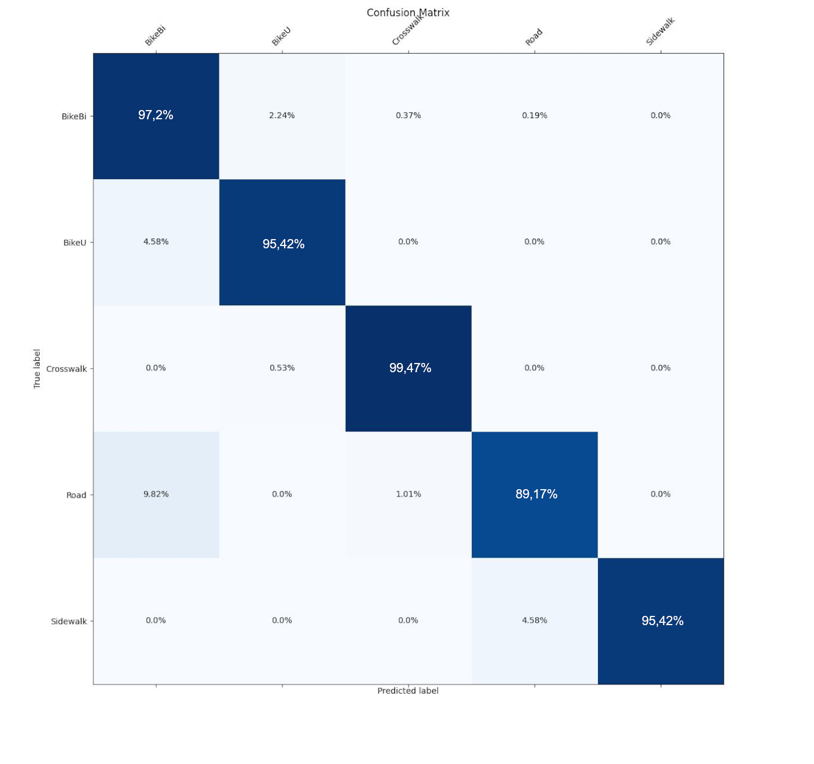

# Artificial vision for kick-scooter - Classification of Type of Road

## Introduction

In recent years the VMP (Personal Mobility Vehicles) have suffered a considerable
increase of popularity and number of users, that find those vehicles to be more suitable for
the life in the city. Although the success of these little vehicles has some advantages for its
users, and society, such as less pollution emissions or portability of the vehicle itself, they
come with some additional risks too, that can put the safety of the user or pedestrians in
danger. These VMP usually drive in aconditioned roads, which each of them, depending on its type, does have its own traffic rules.


## Goal:

The objective of this project is to design a lane type recognition system for personal mobility
vehicles in the city, to increase the safety of users of this type of vehicle, generate possible
data and statistics useful for future studies and study the feasibility and future of this type
of technology in this field.

The system is based on a Deep Learning model trained with previously captured data. The training of the model was implemented with a large number
of training, validation and test images extracted from various videos recorded on the city
during the first weeks of the project. 

## Pre-requisites
1) Python 3.6
2) Python3-Dev (For Ubuntu, `sudo apt-get install python3-dev`)
3) CUDA/10.0 availability and CUDNN/7.4

## Installation
Create virtual environment and use the requirements.txt for the correct versions installation :
```
pip install -r requirements.txt
```
## Usage:
   - Training : all the dataset to train need to be placed inside the directory ['ModelTrain/processed_datalab'] (/TrainingScript.py#L30)
```
python3 TrainingScript.py
```
- Testing : there is only need to introduce
   -  The path to the video the model has to be tested in
   -  The blocksize, which is the number of frames the results is averaged in to create a more reliable classification (default as 120).
```
python final_code.py [path_to_video.mp4] [blocksize]
```
## Results
After fine-tuning our CNN VGG16 with the previously annotated videos (Training), we have evalutated the final model and obtained a great result with all accuracies higher than 89%. 

The confusion matrix presents a really high heat distribution on the diagonal, meaning
every class is generally correctly predicted, with the worst results on the road class, that
shows some confusion with the BikeBi, but is still less than a 10%.



